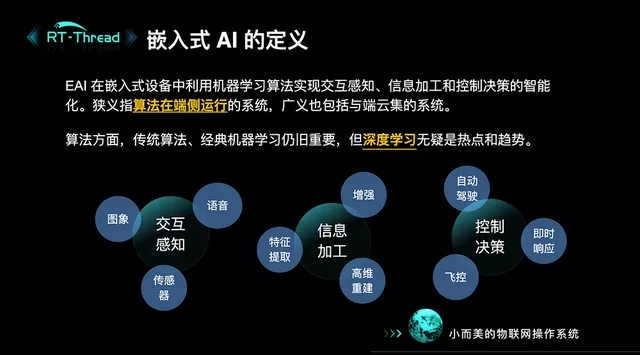
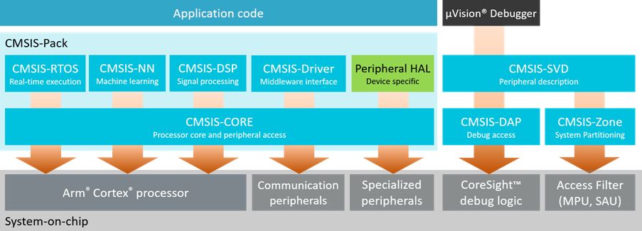
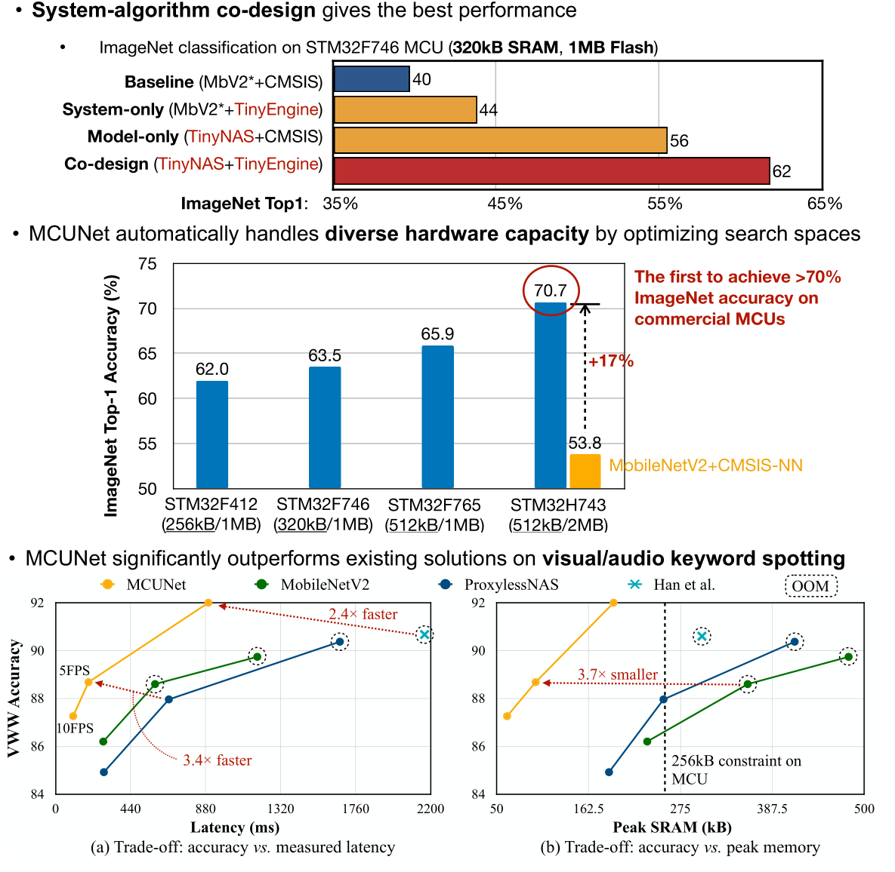
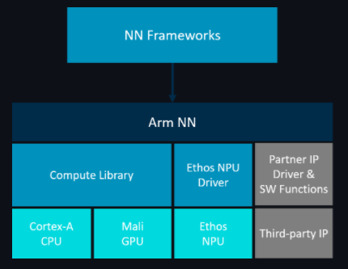
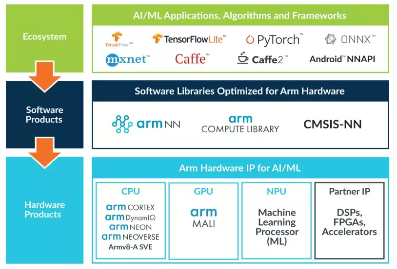
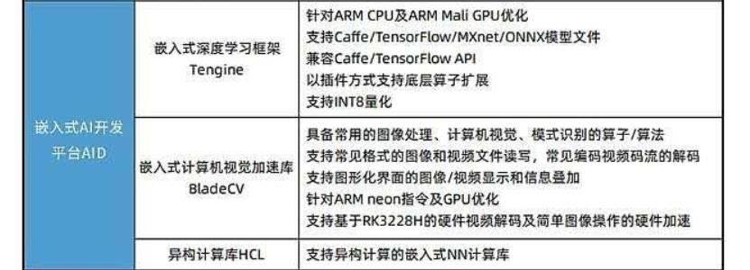

# 嵌入式端的神经网络算法部署和实现

介绍关于 ARM NN、CMSIS NN 和 K210 等嵌入式端的神经网络算法的部署和实现。神经网络的调教（训练）还是在 PC 端，神经网络参数训练好之后，在嵌入式端进行部署（本文的中心），经过在嵌入式端部署进去的神经网络算法对给定数据进行计算从而得出结果，实现算法的嵌入式端部署和运行，这么一个过程。

嵌入式 AI 概念：

更多参考 [如何将训练好的神经网络部署到嵌入式芯片上，如arduino和树莓派等？ - 知乎 (zhihu.com)](https://www.zhihu.com/question/382207885/answer/1184193490)。

**本文提及的 开源库 和 资料 均放在了 [Github](https://github.com/Staok/Awesome-Embeded-AI)/[Gitee](https://gitee.com/staok/Awesome-Embeded-AI) 仓库内。**

------

## 目录

[TOC]

------

## 微控制器 MCU 端

[人工智能的下一轮革命？关于TinyML的一切 - 知乎 (zhihu.com)](https://zhuanlan.zhihu.com/p/483288607)。

### Awesome-Embedded Repository

nhivp/Awesome-Embedded 开源项目下的 Machine Learning & AI on MCU 小节，总结的很好。

[nhivp/Awesome-Embedded: A curated list of awesome embedded programming. (github.com)](https://github.com/nhivp/Awesome-Embedded#machine-learning--ai-on-mcu)，其源文如下：

- [nnom](https://github.com/majianjia/nnom) - A higher-level Neural Network library for microcontrollers.
- [nn4mp](https://github.com/correlllab/nn4mp)
- [Embedded Learning Library (ELL)](https://github.com/Microsoft/ELL) - Microsoft's library to deploy intelligent machine-learned models onto resource constrained platforms and small single-board computers.
- [Qualcomm Neural Processing SDK for AI](https://developer.qualcomm.com/software/qualcomm-neural-processing-sdk) - Libraries to developers run NN models on Snapdragon mobile platforms taking advantage of the CPU, GPU and/or DSP.
- [CMSIS NN](https://arm-software.github.io/CMSIS_5/NN/html/index.html) - A collection of efficient neural network kernels developed to maximize the performance and minimize the memory footprint of neural networks on Cortex-M processor cores.在后文会介绍到
- [ARM Compute Library](https://developer.arm.com/technologies/compute-library) - Set of optimized functions for image processing, computer vision, and machine learning.
- [uTensor](https://github.com/uTensor/uTensor) - AI inference library based on mbed (an RTOS for ARM chipsets) and TensorFlow.
- [EmbededAI](https://github.com/boralt/EmbeddedAI) - A library that provides elements of AI to C++ applications.
- [kann](https://github.com/attractivechaos/kann) - A lightweight C library for artificial neural networks

### 网友自实现的轮子

这里只是举例网上有很多开源的网友自己实现的玩具轮子，比如这里介绍的 BP 神经网络，可以直接跑在 MCU 上。

- BP神经网络的C语言实现-只有三层：[BP神经网络及其C语言实现 - 知乎 (zhihu.com)](https://zhuanlan.zhihu.com/p/27110594)；
- 可以运行在STM32的BP算法实现-任意层：[(BP神经网络C语言实现_一朝英雄拔剑起的博客-CSDN博客_bp神经网络c语言实现](https://blog.csdn.net/qq_39545674/article/details/82495569)；
- [ThreeClassMrWang/c-bpnn: BP神经网络的C语言实现 (github.com)](https://github.com/ThreeClassMrWang/c-bpnn)。
- etc.

如果链接挂了请告诉我。

### Kendryte K210

K210 是 RISC-V 64 位双核处理器，集成了可运行神经网络算法的硬件 IP 核，以及其它常用外设。其可直接跑 kmodel 格式模型，此模型可从 TensorFlow 模型转换为 TFlite 模型、TFLite 模型转换为 K210 的 kmodel 模型 而得到。

我的[Github 仓库-Awesome-K210](https://github.com/Staok/Awesome-K210)收集了关于 K210 的 MaixPy 开发和 SDK IDE 开发等的软、硬件入门资料，帮助初学者快速了解、学习和入门 K210。

这款芯片的生态已经做起来了，相关的开发板、kendryte 官方和 sipeed 官方的资料和例程、各路网友大佬的例程、网络训练以及模型开源等等已经非常丰富。甚至[北航高校已经应用部署到无人机产品上](https://github.com/LZBUAV/K210_Python)了，其项目的描述如下。

>   该项目是 Kendryte K210 AI芯片应用程序的集合，其中包括面部检测，颜色检测，目标检测和分类，QR码和Apriltag码检测以及与ArduPilot飞行软件的通信。 最后，我们可以将这些应用程序部署到无人机终端，使无人机更加智能。
>
>   所实现的应用主要分为两类，第一个是机器视觉应用，该类应用基于openmv机器视觉库；第二类是深度学习应用，该类主要基于Tensorflow和yolov2。详细功能参见用户手册。
>
>    本K210项目为Vision_MAV项目的配套项目，Vision_MAV项目旨在设计并实现一个依托深度学习和图像处理技术的基于视觉的微型无人机系统，能够实现在无GPS环境下的自主视觉导航、目标检测与追踪，该项目由北航无人系统研究院李大伟副教授课题组创立并进行研究，并将在项目没有保密需求后进行开源。本仓库的K210项目是Vision_MAV的一个配套项目，基于[嘉楠科技公司](https://canaan-creative.com/)生产的边缘AI芯片[K210](https://canaan-creative.com/product/kendryteai)，来实现目标检测与追踪，为Vision_MAV项目提供一个可选的视觉解决方案。该项目采用了一块[矽速科技公司](https://www.sipeed.com/)生产的MAXI DOCK K210评估板，来验证K210芯片的AI计算能力。在本项目中，采用传统机器视觉方法实现了最大色块识别、二维码识别、Apriltag码识别、圆形识别，采用深度学习方法实现了人脸识别、人体识别、口罩识别等，并开发了K210和[Ardupilot](https://github.com/ArduPilot/ardupilot)飞控固件之间的[MAVlink](https://github.com/ArduPilot/mavlink)通讯接口，来实时的将K210视觉模组解算出的目标位置信息发送给飞控来控制无人机运动。

### Edge Impulse

可以在线训练各种传感器数据的神经网络模型，处理 图像，语音 or others，然后部署到 自己 MCU 上。

- 官方文档 [Getting Started - Edge Impulse Documentation](https://docs.edgeimpulse.com/docs) 第一手资料。
- 导出模型和库 并部署在自己 MCU 上 [C++ library - Edge Impulse Documentation](https://docs.edgeimpulse.com/docs/deployment/running-your-impulse-locally)。
- API 手册 [Edge Impulse API - Edge Impulse API](https://docs.edgeimpulse.com/reference/edge-impulse-api/edge-impulse-api)。

自己使用的总结，以 ESP32 为例：

1. 提前准备好 ESP32 的 ESP-IDF 编译环境，并且会用，参考 我的相关仓库 [esp8266-esp32-development/ESP-IDF-IDE编程 at master · Staok/esp8266-esp32-development (github.com)](https://github.com/Staok/esp8266-esp32-development/tree/master/ESP-IDF-IDE编程)，Gitee 地址 [ESP-IDF-IDE编程 · 瞰百/esp8266-esp32-development - 码云 - 开源中国 (gitee.com)](https://gitee.com/staok/esp8266-esp32-development/tree/master/ESP-IDF-IDE编程)。
2. 按照[官网 Getting Started 手册的步骤](https://docs.edgeimpulse.com/docs)，官网注册账户、新建工程、输入数据、构建模型、在线训练、导出 Edge Impulse C++ 库。
3. 参考 [On your Espressif ESP-EYE (ESP32) development board - Edge Impulse Documentation](https://docs.edgeimpulse.com/docs/deployment/running-your-impulse-locally/running-your-impulse-esp32)，首先做一个最小工程，按照这个链接里面的步骤。
4. 更多详细参考 本仓库下 `\Edge Impulses` 文件夹内 说明，可以顺利编译 带 Edge Impulse 库的工程。

一些网友教程：

- [零基础的嵌入式机器学习：Edge Impulse使用教程之训练模型浅析(1)——分类模型_方恪的博客-CSDN博客](https://blog.csdn.net/m0_56041246/article/details/118912412)。
- [零基础的嵌入式机器学习：Edge Impulse使用教程之训练模型浅析(2)——回归(预测)模型_方恪的博客-CSDN博客](https://blog.csdn.net/m0_56041246/article/details/118937781)。

与常见 MCU 结合：

- [零基础的嵌入式机器学习：Edge Impulse训练模型移植STM32F407ZGT6实例_方恪的博客-CSDN博客_stm32运行训练好的模型](https://blog.csdn.net/m0_56041246/article/details/118862272)。
- [使用 Edge Impulse 在 ESP32 上运行机器学习算法 - 知乎 (zhihu.com)](https://zhuanlan.zhihu.com/p/420887314)。[使用 Edge Impulse 在 ESP32 上运行机器学习算法 | 乐鑫科技 (espressif.com.cn)](https://www.espressif.com.cn/zh-hans/news/ESP32_EdgeImpulse?position=5&list=zxpdcK3NOKbbbxj_ypHZpjgl6d1eLQ-Et_ESte4r-us)。
- 但这是生成 Arduino 库，[TinyML ESP32-CAM: Edge Image classification with Edge Impulse (survivingwithandroid.com)](https://www.survivingwithandroid.com/tinyml-esp32-cam-edge-image-classification-with-edge-impulse/)。

### ST X-Cube-AI

通过 STM32Cube.AI ，开发人员现在可以将预先训练的神经网络转换为 C 代码，该代码可以调用在 STM32 MCU 上运行的优化库中的函数。这是 ST 公司针对 STM32CubeMX IDE 的一个扩展软件库，下载安装 STM32Cube 后可以在其内下载安装 X-Cube-AI 组件，进而可以进行 神经网络的配置，然后由  STM32CubeMX IDE 产生 STM32 MCU 的 软件开发工程。

用 ST X-Cube-AI 是把 Keras、TF lite、ONNX、Lasagne、Caffe、ConvNetJS 等框架训练的神经网络模型转换为 内存优化的、可在 STM32 上运行的程序/数据结构，建议全程在 CubeMX 软件里面操作，直接生成工程。

特点：

- 从预先训练的神经网络模型生成 STM32 优化的库；
- 支持各种深度学习框架，如 Keras、TF lite、ONNX、Lasagne、Caffe、ConvNetJS 等；
- 通过 STM32Cube™ 集成，可轻松在不同 STM32 微控制器系列实现，并生成软件工程；
- 允许多个人工神经网络在单个STM32 MCU上运行；
- 完全支持超低功耗STM32 MCU；
- 免费，用户友好的许可条款。

相关网页：

- [ST 官网 X-Cube-AI 首页 STM32 solutions for Artificial Neural Networks](https://www.st.com/content/st_com/zh/ecosystems/stm32-ann.html#stm32-sann-featuredcontentcontainer)。
- [ST 官网 X-CUBE-AI 下载页](https://www.st.com/zh/embedded-software/x-cube-ai.html)。推荐不要单独下载，在 STM32CubeMX IDE 中安装组件并直接产生程序工程。
- [ST Cude.AI 介绍页 (stmcu.com.cn)](https://www.stmcu.com.cn/ecosystem/app/ai)。
- [ST 官网 X-CUBE-AI 慕课](https://www.st.com/content/st_com/zh/support/learning/stm32-education/stm32-moocs/Introduction_to_STM32CubeAI_MOOC.html)。

网络教程：

- [STM32CubeMX AI尝尝鲜](https://www.icode9.com/content-4-640741.html)。
- [嵌入式MCU也能跑AI？STM32 Cube.AI工具包使用初探](https://zhuanlan.zhihu.com/p/64353677)。
- [【嵌入式AI开发】篇四|部署篇：STM32cubeIDE上部署神经网络之模型部署 (qq.com)](https://mp.weixin.qq.com/s?__biz=Mzg2NTY1OTA3Nw==&mid=2247484272&idx=1&sn=4dadc390c97a1552f60ca3fd68007f36&chksm=ce57f2daf9207bcc452735449a996d4ad1d72e006908fe7bc161f2e29b191de79dea5f1f826b&scene=178&cur_album_id=2084907594690674690#rd)。
- [【嵌入式AI开发】篇五|实战篇一：STM32cubeIDE上部署神经网络之pytorch搭建指纹识别模型.onnx (qq.com)](https://mp.weixin.qq.com/s?__biz=Mzg2NTY1OTA3Nw==&mid=2247484307&idx=1&sn=3cae454a376dc51adc11587f099dd87e&chksm=ce57f239f9207b2f3f5700d975325abefbe342ef0b8b78661c8caf3a34b439ecd853c0203d1f&scene=21#wechat_redirect)。
- [我在STM32单片机上跑神经网络算法(文章结尾有学习资料和学习群) - 知乎 (zhihu.com)](https://zhuanlan.zhihu.com/p/449335680)。
- [在STM32上部署神经网络实现人体活动识别_哔哩哔哩_bilibili](https://www.bilibili.com/video/BV1uK411D79q/)。

### CMSIS-NN

CMSIS (Cortex Microcontroller Software Interface Standard) 是针对 Cortex-M MCU 和 Cortex-A5/A7/A9 处理器的一组软件应用框架，是标准化软件组件库，抽离出公共部分组件和启动文件等，简化开发，并提供很多高效的软件实现。下图示意其组成部件。

[CMSIS 的 Github 仓库](https://github.com/ARM-software/CMSIS_5)；[CMSIS 的使用文档](https://arm-software.github.io/CMSIS_5/General/html/index.html)。

其中这里最关心 CMSIS-NN。

**介绍**

Collection of efficient neural network kernels，Neural networks and machine learning are functions that are being pushed into the end node if IoT applications.

The neural network kernels of the [**CMSIS-NN**](https://arm-software.github.io/CMSIS_5/NN/html/index.html) library help to maximize the performance and minimize the memory footprint of neural networks on Cortex-M processor cores. 

**提供的函数库**

The library is divided into a number of functions each covering a specific category：

-   Convolution Functions；
-   Activation Functions；
-   Fully-connected Layer Functions；
-   Pooling Functions；
-   Softmax Functions；
-   Basic math Functions。

The functions can be classified into two segments：

-   Legacy functions supporting ARM's internal symmetric quantization(8 bits).
-   Functions that support TensorFlow Lite framework with symmetric quantization(8 bits).

The legacy functions can be identified with their suffix of _q7 or _q15 and are no new development is done there. The article in [2] describes in detail how to run a network using the legacy functions.

The functions supporting TensorFlow Lite framework is identified by the _s8 suffix and can be invoked from TFL micro. The functions are bit exact to TensorFlow Lite. Refer to the TensorFlow's documentation in [3] on how to run a TensorFlow Lite model using optimized CMSIS-NN kernels.

**源码、手册和例程**

[CMSIS-NN 官方 Github 仓库，包含手册、例程等](https://github.com/ARM-software/CMSIS_5/tree/develop/CMSIS/NN)。

[官方教程集：CMSIS-NN 在 Arm Cortex-M 的应用](https://developer.arm.com/solutions/machine-learning-on-arm/developer-material/how-to-guides#cortex-m)。

[安富莱的 CMSIS-NN 开源教程和例程（暂时还没出）](http://www.armbbs.cn/forum.php?mod=viewthread&tid=94547)。

**总结**

这里 CMSIS-NN 是结合 CMSIS DSP库，二者一块完成一些机器学习基本算子函数的库，可以在ARM Cortex M 的 MCU 开发中直接 include 然后调用 API 进行神经网络搭建；还可以使用 CMSIS-NN kernels 来运行 TensorFlow Lite 模型。

**CMSIS-DSP 的介绍**

CMSIS-DSP: Fast implementation of digital signal processing

Developing a real-time digital signal processing (DSP) system is not trivial as the DSP algorithms heavily rely on complex mathematical operations that are even time-critical.

[**CMSIS-DSP**](https://arm-software.github.io/CMSIS_5/DSP/html/index.html) library is a rich collection of DSP functions that are optimized by ARM for the various Cortex-M processor cores. CMSIS-DSP is widely used in the industry and enables also optimized C code generation from [MATLAB®](https://www.mathworks.com/hardware-support/arm-cortex-m-cmsis.html). The [ASN Filter Designer](https://www2.keil.com/mdk5/cmsis/asnfd) generates CMSIS-DSP code that you can directly use in your application.

关于 CMSIS-DSP 的学习和使用，"安富莱"进行了不少的摸索和验证，并出了几百页的教程，对于初学者足够够的了。

[安富莱的 硬汉嵌入式论坛](http://www.armbbs.cn/)；[安富莱官网](http://www.armfly.com/)；[安富莱的 CMSIS-DSP 开源教程和例程](http://www.armbbs.cn/forum.php?mod=viewthread&tid=94547)；[CMSIS-DSP 官方例子（Github）](https://github.com/ARM-software/CMSIS_5/tree/develop/CMSIS/DSP/Examples/ARM)。

### TensorFlowLite

TensorFlowLite 可被用于微控制器（MCU）和其它只有千字节内存的设备。（这里有待补充更多信息和官网网页）

特点：

- 不需要操作系统支持，可以移植和 “裸机” 运行在 Cortex-M3\M4 等内核的 MCU 上，20KB ~ 1MB 量级的容量占用。
- 官方有支持 STM32F746 的 Discover 板等。[适用于微控制器的 TensorFlow Lite (google.cn)](https://tensorflow.google.cn/lite/microcontrollers?hl=zh-cn)。
- 适合嵌入式开发，代码库小，模块化，入门容易，有移植各平台示例。

### TinyML Projects

网络文章介绍：[【嵌入式AI开发】MCUNet: Tiny Deep Learning on IoT Devices-微型机器学习时代已经到来了 (qq.com)](https://mp.weixin.qq.com/s?__biz=Mzg2NTY1OTA3Nw==&mid=2247484333&idx=1&sn=9313a25db99a3a70402a92386e86ecf3&chksm=ce57f207f9207b11dab79ba7e8dca94a4c9b3d8ec3acc6caa6d32602465c570e1605ee09e34e&scene=178&cur_album_id=2084907594690674690#rd)。

[Tiny Machine Learning 项目主页](https://hanlab.mit.edu/projects/tinyml/)。

TinyML Projects 分为两个部分：

-   [MCUNet (inference, microcontrollers)](https://hanlab.mit.edu/projects/tinyml/mcunet/)。
-   [TinyTL (on-device learning, memory-efficient transfer learning)](https://hanlab.mit.edu/projects/tinyml/tinyTL/)。

论文、PPT、海报和源码等均已开源，商业权被大公司以超超高价买下。

MCUNet 实验结论：

------

## 微处理器 MPU 端

这里的微处理器 MPU 暂指 ARM Cortex-A 内核的。

### ARM Compute Library

[ARM Compute Library 官网介绍主页](https://developer.arm.com/ip-products/processors/machine-learning/compute-library)。

> The Arm Compute Library is a collection of low-level machine learning functions optimized for Cortex-A CPU and Mali GPU architectures. The library provides ML acceleration on Cortex-A CPU through Neon, or SVE and acceleration on Mali GPU through Open CL.
>
> Key features：
>
> - Over 100 machine learning functions for CPU and GPU
> - Multiple convolution algorithms (GEMM, Winograd, FFT, and Direct)
> - Support for multiple data types: FP32, FP16, int8, uint8, BFloat16
> - Micro-architecture optimization for key ML primitives
> - Highly configurable build options
>
> Supported Architectures/Technologies：
>
> - Arm® CPUs:
>   - Arm® Cortex®-A processor family using Arm® Neon™ technology
>   - Arm® Cortex®-R processor family with Armv8-R AArch64 architecture using Arm® Neon™ technology
>   - Arm® Cortex®-X1 processor using Arm® Neon™ technology
> - Arm® Mali™ GPUs:
>   - Arm® Mali™-G processor family
>   - Arm® Mali™-T processor family

基本的，ARM Compute Library 为 ARM Cortex-A 处理器提供了针对性优化的一打的机器学习算法函数，可以使用这些 API 直接构建起神经网络模型，训练或者运行。

> Tutorials:
>
> - [Tutorial: Cartoonifying Images on Raspberry Pi with the Compute Library](https://community.arm.com/graphics/b/blog/posts/cartoonifying-images-on-raspberry-pi-with-the-compute-library)
> - [Tutorial: Running AlexNet on Raspberry Pi with Compute Library](https://community.arm.com/processors/b/blog/posts/running-alexnet-on-raspberry-pi-with-compute-library)

Github 仓库 [ARM-software/ComputeLibrary: The Compute Library is a set of computer vision and machine learning functions optimised for both Arm CPUs and GPUs using SIMD technologies. (github.com)](https://github.com/ARM-software/ComputeLibrary)。

官方手册 [Compute Library: Introduction (arm-software.github.io)](https://arm-software.github.io/ComputeLibrary/latest/)。

### ARM NN

ARM NN 是 [ARM Compute Library](https://github.com/ARM-software/ComputeLibrary) 的高级封装，ARM Compute Library 提供对 ARM Cortex-A 优化的神经网络基本算子，可以使用 ARM Compute Library 的 API 直接自己搭建神经网络算法，或者使用在这里介绍的 ARM NN，转化主流神经网络框架训练好的模型并使用。ARM NN 是 ARM 公司 在 Cortex-A 嵌入式端  "[AI and Machine Learning](https://developer.arm.com/solutions/machine-learning-on-arm)" 主题的 关键项目。

Github 仓库 [ARM-software/armnn: Arm NN ML Software. The code here is a read-only mirror of https://review.mlplatform.org/admin/repos/ml/armnn (github.com)](https://github.com/arm-software/armnn)。

>   The Arm NN SDK is a set of open-source software and tools that enables machine learning workloads on power-efficient devices. It provides a bridge between existing neural network frameworks and power-efficient Cortex-A CPUs, Arm Mali GPUs and Arm Ethos NPUs.
>
>   Arm NN SDK utilizes the Compute Library to target programmable cores, such as Cortex-A CPUs and Mali GPUs, as efficiently as possible. 
>
>   

ARM NN 是 使用C++语言，可以直接载入如 tensorflow lite 框架生成的神经网络模型文件，然后对模型进行分析和优化，使之底层调用适合 ARM 内核的指令或者 NPU 单元 实现运算加速，然后再使用 ARM NN 的 API 载入优化过的模型，进行推理计算，得到结果。

> The machine learning platform libraries – Arm NN and Arm Compute Library – bridge the gap between existing neural network (NN) frameworks, such as TensorFlow, TensorFlow Lite, Caffe and ONNX, and the underlying IP.
>
> They enable efficient translation of these NN frameworks, allowing them to run efficiently – without modification – across Arm Cortex-A CPUs, Arm Mali GPUs and the Arm ML processor.
>
> 

官方生态文章和实例：

-   [ARM NN 官方的应用文章](https://developer.arm.com/solutions/machine-learning-on-arm/developer-material/how-to-guides#armnn)。
-   [ARM NN 官方的在树莓派上使用](https://developer.arm.com/solutions/machine-learning-on-arm/developer-material/how-to-guides#mlrpi)。
-   [ARM 官网 - AI and Machine Learning 白皮书 各种应用介绍](https://developer.arm.com/solutions/machine-learning-on-arm/developer-material/white-papers-and-research-papers)。

网友实例：

-   [被低估的ArmNN（一）如何编译](https://zhuanlan.zhihu.com/p/71369040)。
-   [【树莓派/目标检测】(二)armnn编译](https://blog.csdn.net/qq_33446100/article/details/114024776)。
-   看来目前还不是很多。

### PyArmNN

[PyArmNN 的 Github 仓库](https://github.com/NXPmicro/pyarmnn-release)。

PyArmNN 是 ARM NN 的 Python 实现，使用 Python 语言，干的活和 ARM NN 一样。

网友实例：

-   [Accelerating ML inference on X-Ray detection at edge using Raspberry Pi with PyArmNN](https://community.arm.com/developer/ip-products/processors/b/ml-ip-blog/posts/ml-inference-x-ray-detection-edge-raspberry-pi-pyarmnn)。
-   看来目前还不是很多。

## 总结

- stm32 这种 ARM Cortex-M 的单片机应该用 CMSIS-NN 去复现（或者运行 TensorFlow Lite）神经网络模型，或者使用 Awesome-Embedded Repository 等小节介绍的轮子；

- 而到了ARM Cortex-A 系列的运行 Linux 的平台，就使用 ARM NN 这个库，导入 TF 或者 Pytorch 的模型，进行优化加速。

所以都属于转化，主要还是算法设计。

## 其它嵌入式AI算法实现库

- [uingrd/EmbeddedML: 《AI嵌入式系统——算法优化与实现》软件工具、例程及教学辅助材料 (github.com)](https://github.com/uingrd/EmbeddedML)。

  已经离线在 `/uingrd-EmbeddedML` 文件夹里面

- .etc

## 其他平台

不太熟悉，只是罗列。

